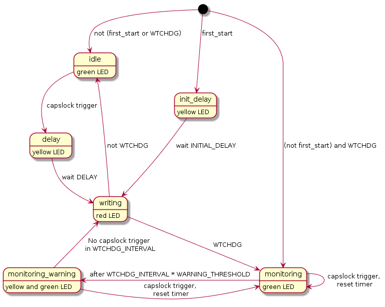

# kbdwtchdg
## Overview
A watchdog running [V-USB](http://www.obdev.at/vusb/) on an Attiny85 that identifies itself as a USB keyboard and sends keyboard strokes.

## What Can kbdwtchdg Do?
It sends a defined message via USB to the computer. It does that either after a specific period of time after being plugged in,
or after a capslock trigger (pressing capslock x times).

## How to Use
The repo contains an AtmelStudio 7 project file that is preconfigured for kbdwtchdg. 

[Documentation can be found here.](http://kbdwtchdg.readthedocs.io)

## Acknowledgements
The code of this project is based on [Frank Zhao's USB business card](http://www.instructables.com/id/USB-PCB-Business-Card/) and built based on Dovydas R.'s circuit diagram for [usb_pass_input_with_buttons](https://github.com/Dovydas-R/usb_pass_input_with_buttons).
