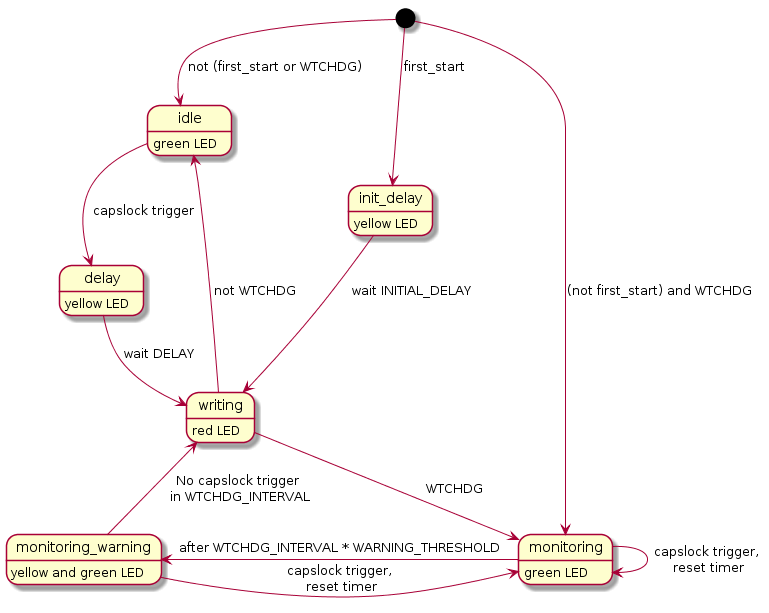

Welcome to kbdwtchdg's documentation!
=====================================

Overview
--------

A watchdog running `V-USB <http://www.obdev.at/vusb/>`_ on an Attiny85 that identifies itself as a USB keyboard and sends keyboard strokes.

What Can kbdwtchdg Do?
----------------------

WTCHDG Mode
^^^^^^^^^^^

In WTCHDG mode, kbdwtchdg listens for the capslock trigger to occur during WTCHDG_INTERVAL. If no trigger occurs, the text is written.
If a trigger occurs, the timer is reset.

Non-WTCHDG Mode
^^^^^^^^^^^^^^^

After receiving the capslock trigger and waiting for DELAY time the text is written.

Initial Writing
^^^^^^^^^^^^^^^

If first_start is set the text is written after INITIAL_DELAY after power up.

How to Use
----------

The repo contains an AtmelStudio 7 project file that is preconfigured for kbdwtchdg.

Acknowledgements
----------------

The code of this project is based on `Frank Zhao's USB business card <http://www.instructables.com/id/USB-PCB-Business-Card/>`_ and
built based on Dovydas R.'s circuit diagram for `usb_pass_input_with_buttons <https://github.com/Dovydas-R/usb_pass_input_with_buttons>`_.

This documentation was built using `antiweb <http://antiweb.readthedocs.io>`_

.. toctree::
   :maxdepth: 1
   :hidden:

   setup
   main
   antiweb
   changelog
