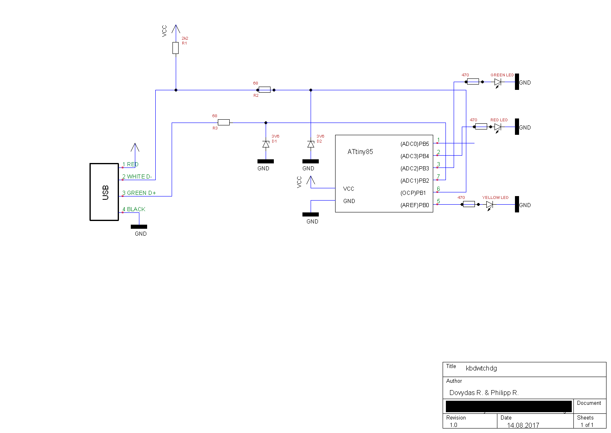
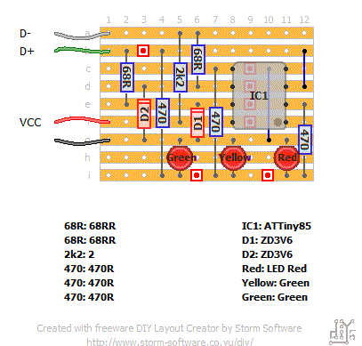
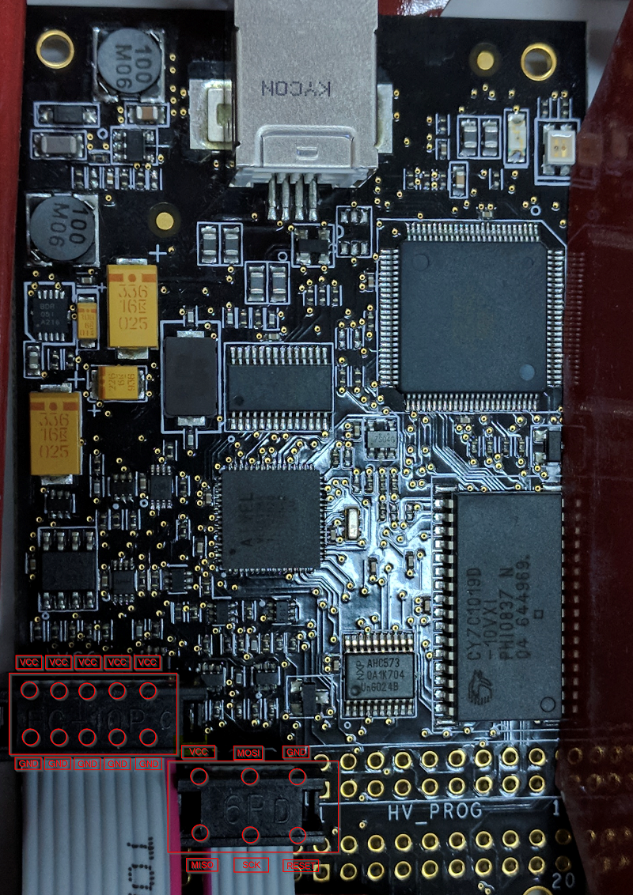
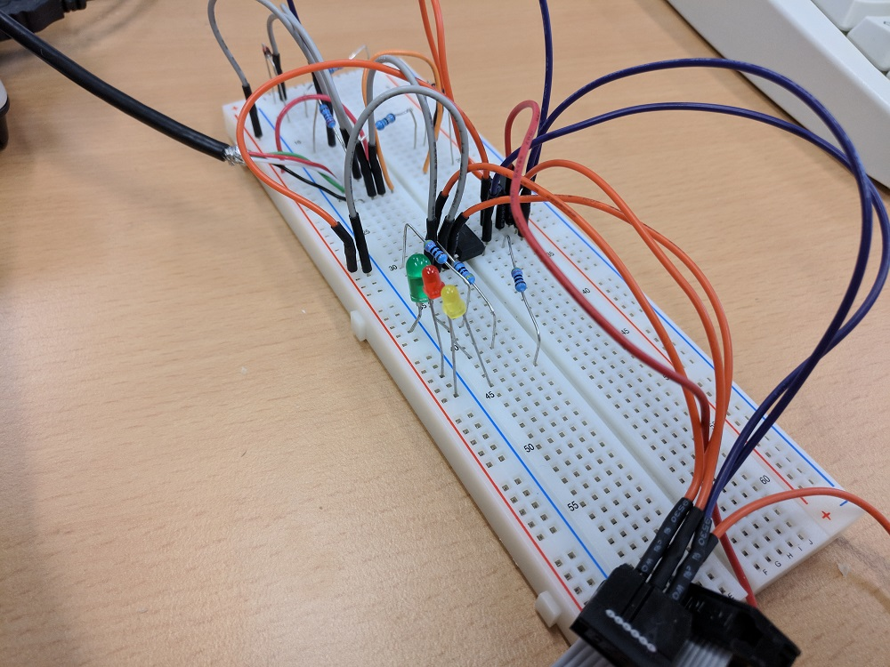
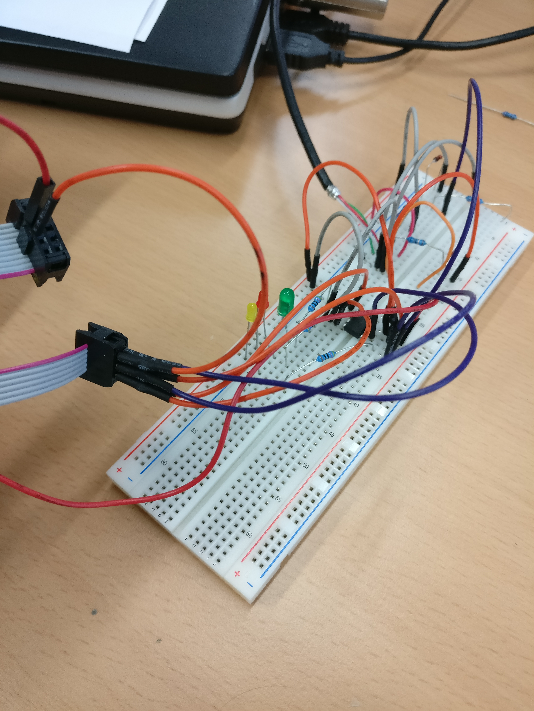
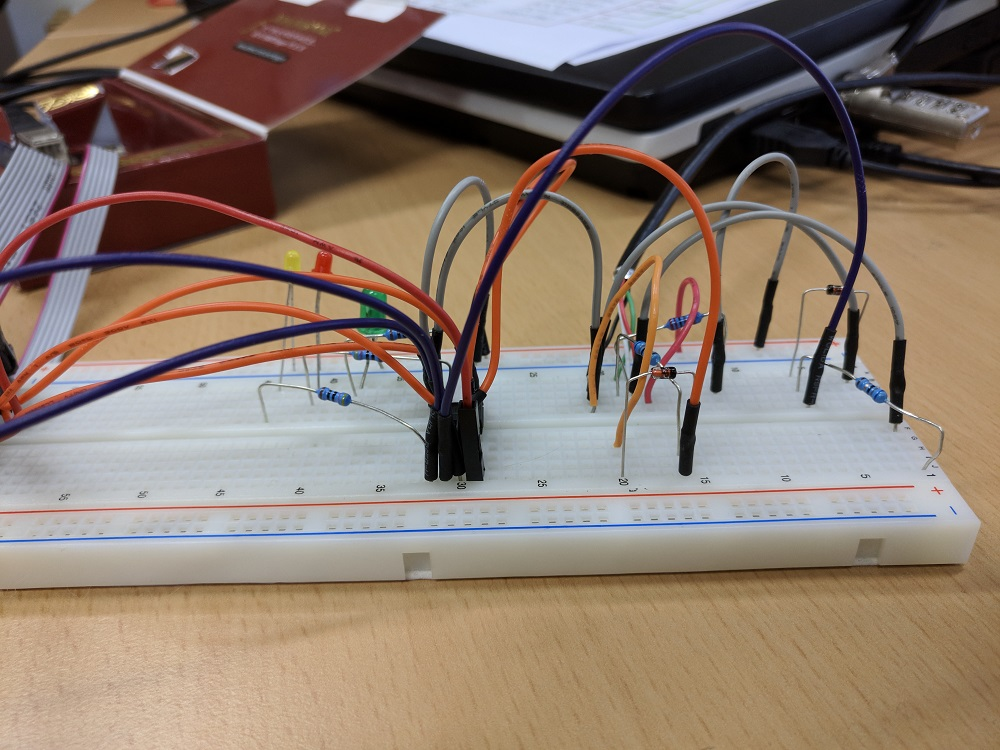
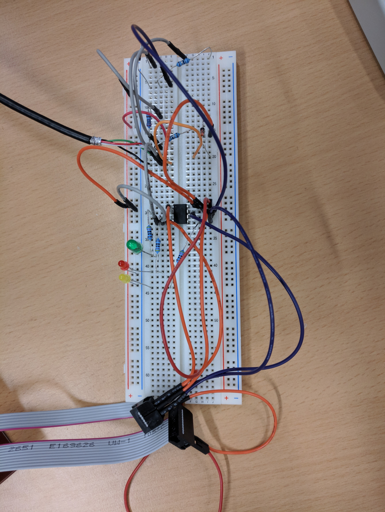

*************
Project setup
*************

Hardware preparation
====================

Before programming your Attiny85 to run kbdwtchdg you need to build your circuit.
We built our project according to the following diagram:

   
Below you can find our suggested layout for the soldering:

Below is an example photo of the connections on the AVR Dragon programmer:

AtmelStudio 7
=============

There is an AtmelStudio 7 project file inside the repository (kbdwtchdg.atsln). It is preconfigured to use the kbdwtchdg folder
as its project folder. After you made sure all your wires are connected and you selected your programmer (you can check that by 
reading the voltage and device signature in Tools -> Device Programming) you can build the project using Build/Build kbdwtchdg. If 
there are no errors you can proceed to load the project onto your Microcontroller using Debug -> Start without Debugging (Ctrl+Alt+F5). 

Configuring the project
=======================

There are four (4) variables a user may change to adapt kbdwtchdg to their needs. Those are:

* ``DELAY`` To change the delay after a capslock trigger (in 1/100 seconds)
* ``INITIAL_DELAY`` To change the delay after first power up
* ``THRESHOLD`` To change the number of capslock presses needed for a trigger
* ``TEXT`` To change the text that is being sent

Example photos
==============

Below you can find some photos we took from our project

