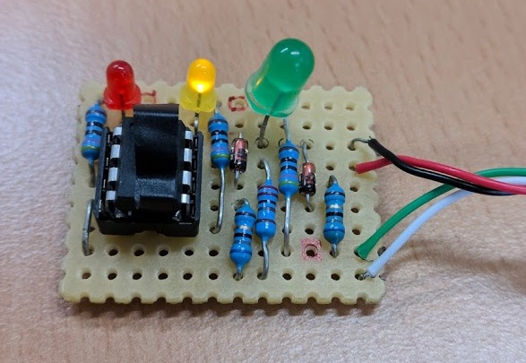

*************
Project setup
*************

Hardware preparation
====================

Before programming your Attiny85 to run kbdwtchdg you need to build your circuit.
We built our project according to the following diagram:

   
Below you can find our suggested layout for the soldering:

   
This is the finished ATtiny85 board:

Below is an example photo of the connections on the AVR Dragon programmer:

AtmelStudio 7
=============

There is an AtmelStudio 7 project file inside the repository (kbdwtchdg.atsln). It is preconfigured to use the kbdwtchdg folder
as its project folder. After you made sure all your wires are connected and you selected your programmer (you can check that by 
reading the voltage and device signature in Tools -> Device Programming) you can build the project using Build/Build kbdwtchdg. If 
there are no errors you can proceed to load the project onto your Microcontroller using Debug -> Start without Debugging (Ctrl+Alt+F5). 

Configuring the Project
=======================

See :ref:`label-variables`.
